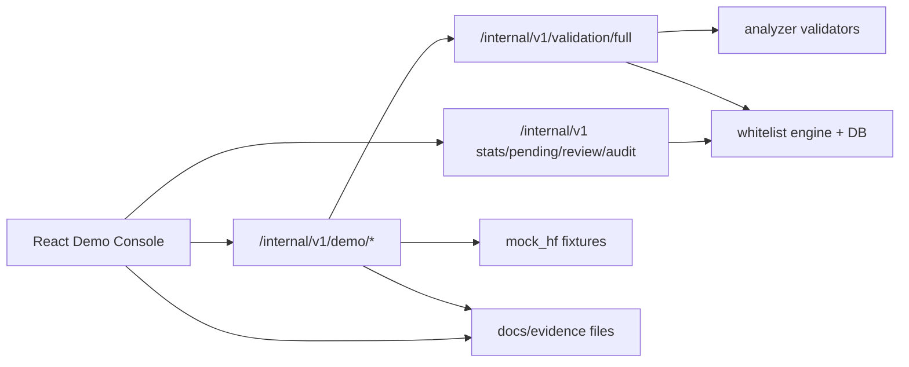

# HuggingMask Frontend Demo Console 설계도

작성일: 2026-06-08  
목적: 교수님 시연에서 HuggingMask의 전체 설계, 진행 과정, 실제 검증 흐름, 운영 증빙을 한 화면 흐름으로 설명할 수 있는 프론트엔드와 최소 백엔드 보조 API를 설계한다.

## 1. 결론

프론트는 기존 `whitelist/static/dashboard.html`을 조금 고치는 수준이 아니라, `frontend/` 디렉터리의 React + TypeScript 앱으로 새로 만든다. 다만 백엔드는 현재 FastAPI 구조를 유지하고, 기존 `/dashboard` 진입점은 새 프론트 빌드 결과를 서빙하도록 바꾼다.

핵심 판단은 다음과 같다.

- 교수님 시연의 첫 화면은 랜딩 페이지가 아니라 실제 운영 콘솔이어야 한다.
- 브라우저가 직접 `/internal/v1/validation/full` 요청을 만들기 어렵다. 이 API는 서버가 읽을 수 있는 `temp_local_path`, 정확한 `sha256`, `size_bytes`가 필요하다. 따라서 `mock_hf` fixture를 서버에서 읽어 검증 job을 만드는 데모 전용 API를 추가해야 한다.
- 시연의 기본 경로는 5개 고정 fixture 시나리오여야 한다. 실시간 Hugging Face 다운로드는 네트워크 변수 때문에 보조 기능으로 둔다.
- `PASS/BLOCK/PENDING_REVIEW`는 artifact/file 단위 상태이고, `APPROVE/DENY/REVIEW_REQUIRED`는 job 단위 결정이다. UI에서 이 둘을 분리해서 표시한다.
- `AUTO_APPROVE`는 실제 승인 완료가 아니라 pending API의 추천 분류다. Review 액션이 끝나야 whitelist에 반영된다.

## 2. 목표 사용자와 발표 목표

주 사용자:

- 발표자: 교수님 앞에서 4-6분 안에 전체 시스템을 안정적으로 설명해야 한다.
- 교수님/평가자: 내부 코드를 몰라도 설계 의도, 검증 흐름, 증빙 수준을 빠르게 판단해야 한다.
- 개발자 본인: 발표 전후에 API 상태, pending queue, audit chain, evidence를 확인해야 한다.

프론트가 답해야 하는 질문:

- 이 프로젝트가 어떤 위험을 막는가?
- safetensors, pickle, Python code, config는 왜 서로 다른 검증 경로를 타는가?
- 실제로 정상 입력과 악성 입력을 구분하는가?
- 차단 이유가 설명 가능한가?
- 운영자가 미등록 API를 어떻게 리뷰하고 기록하는가?
- 테스트와 증빙이 남아 있는가?

## 3. 범위

### 포함

- 새 React/Vite/TypeScript 프론트 앱
- FastAPI에서 새 프론트 빌드 결과 서빙
- `mock_hf` fixture 기반 데모 시나리오 API
- 기존 운영 API 연결: stats, whitelist check, pending, review, approved, feedback, audit, audit verify
- 증빙 화면: demo logs, test evidence, worklog, 문서 링크
- 반응형 UI: 노트북, 프로젝터, 1366px, 1920px, 모바일 최소 대응
- Playwright 또는 브라우저 검증을 통한 시각 확인

### 제외

- 로그인/권한 시스템
- 외부 배포용 멀티 테넌트 기능
- 실시간 파일 업로드 기반 production ingestion
- Hugging Face 전체 repo production crawler
- B-2 gVisor를 기본 검증 경로처럼 보이게 만드는 UI
- 기존 analyzer/whitelist 판정 로직의 의미 변경

## 4. 기술 선택

권장 스택:

- `frontend/`: Vite + React + TypeScript
- 데이터 fetching: `@tanstack/react-query`
- 라우팅: `react-router-dom`
- 아이콘: `lucide-react`
- 스타일: CSS Modules 또는 전역 `src/styles/*.css`
- 테스트: Vitest + React Testing Library, Playwright smoke
- 백엔드 서빙: FastAPI `StaticFiles` 또는 `HTMLResponse` fallback

의도:

- 발표용 완성도와 유지보수성을 위해 단일 HTML보다 컴포넌트 기반이 낫다.
- shadcn/ui 같은 대형 UI 레이어는 필수는 아니다. 시간이 충분해도 의존성보다 안정성과 읽기 쉬운 CSS를 우선한다.
- 차트 라이브러리는 처음부터 넣지 않는다. pipeline/timeline은 CSS grid와 semantic HTML로 구현한다.

## 5. 전체 아키텍처



런타임 구조:

- 개발 중: `uvicorn proxy.app.main:app --port 8000` + `npm run dev -- --host 127.0.0.1`
- 발표 안정 모드: `npm run build` 후 FastAPI가 `frontend/dist`를 `/dashboard`와 `/assets/*`로 서빙
- Docker 발표 모드: Dockerfile에 Node build stage를 추가하거나, 발표 직전에 로컬 `frontend/dist`를 빌드해 compose volume으로 제공

## 6. 파일 구조

권장 추가/수정 파일:

```text
frontend/
  package.json
  index.html
  tsconfig.json
  vite.config.ts
  src/
    main.tsx
    app/App.tsx
    app/routes.tsx
    api/client.ts
    api/types.ts
    api/demo.ts
    api/ops.ts
    components/
      Badge.tsx
      Button.tsx
      EmptyState.tsx
      ErrorPanel.tsx
      Field.tsx
      MetricTile.tsx
      Modal.tsx
      PageHeader.tsx
      StatusPill.tsx
      Table.tsx
      Timeline.tsx
    features/
      overview/
      demo/
      validation/
      operations/
      evidence/
    styles/
      base.css
      tokens.css
      layout.css
      components.css
proxy/app/demo.py
proxy/app/static_frontend.py
tests/test_demo_api.py
tests/test_frontend_static.py
```

기존 파일 수정:

- `proxy/app/main.py`: demo router와 frontend static serving 연결
- `Dockerfile`: 선택적으로 frontend build stage 추가
- `compose.yaml`: 필요 시 프론트 dev 서버 포트 문서화
- `README.md` 또는 `SETUP_GUIDE.md`: 새 실행 방법 추가
- 기존 `whitelist/static/dashboard.html`: 즉시 삭제하지 말고 legacy fallback으로 유지하거나 문서상 deprecated 처리

## 7. 백엔드 보조 API 설계

### 7.1 Demo Scenario API

새 router:

```text
prefix: /internal/v1/demo
file: proxy/app/demo.py
```

#### GET `/internal/v1/demo/scenarios`

목적: 프론트가 실행 가능한 시나리오 목록을 표시한다.

응답:

```json
{
  "items": [
    {
      "scenario_id": "hm-01-safe-st",
      "title": "정상 safetensors",
      "category": "safe",
      "policy_profile": "strict_default",
      "expected_overall_decision": "APPROVE",
      "expected_overall_status": "PASS",
      "expected_release_action": "APPROVE_AND_STORE",
      "expected_reason_codes": ["SAFE_TENSORS_HASH_OK"],
      "primary_stage": "VALIDATE_SAFETENSORS",
      "fixture_path": "mock_hf/hm-01-safe-st",
      "stable": true,
      "notes": ["Second request should show CACHE_HIT."]
    }
  ]
}
```

데이터 출처:

- `mock_hf/*/expected_result.json`
- `mock_hf/*/fixture_manifest.json`

#### GET `/internal/v1/demo/scenarios/{scenario_id}`

목적: 선택된 시나리오의 fixture 파일, 기대 결과, 발표 멘트, 제한 사항을 표시한다.

응답 필드:

- `scenario_id`
- `title`
- `policy_profile`
- `required_repo_files`
- `files_present_in_repo`
- `artifacts_to_generate`
- `expected`
- `source_files`: 텍스트 파일은 preview 가능하게 짧은 excerpt 제공

주의:

- source preview는 길이를 제한한다.
- 바이너리 artifact는 preview하지 않는다.

#### POST `/internal/v1/demo/scenarios/{scenario_id}/run`

목적: 서버가 fixture를 읽어 `ValidationJobRequest`를 생성하고 `/internal/v1/validation/full`과 같은 내부 경로를 실행한다.

요청:

```json
{
  "repeat_cache_check": false,
  "reset_demo_state": false,
  "enable_path_b": false,
  "requested_by": "demo_presenter"
}
```

응답:

```json
{
  "scenario_id": "hm-03-bad-pkl-reduce",
  "run_id": "demo_20260608_001",
  "started_at": "2026-06-08T09:00:00Z",
  "finished_at": "2026-06-08T09:00:01Z",
  "expected": {
    "overall_decision": "DENY",
    "overall_status": "BLOCK",
    "release_action": "DENY",
    "reason_codes": ["PICKLE_OPCODE_BLOCKED"]
  },
  "actual": {
    "overall_decision": "DENY",
    "overall_status": "BLOCK",
    "release_action": "DENY",
    "reason_codes": ["PICKLE_OPCODE_BLOCKED"]
  },
  "matched_expectation": true,
  "validation_response": {}
}
```

구현 규칙:

- `mock_hf/*/fixture_manifest.json`의 `artifacts_to_generate`가 있으면 서버에서 임시 artifact를 만든다.
- artifact metadata는 실제 파일에서 `sha256`, `size_bytes`, `temp_local_path`를 계산한다.
- fixture directory 밖 파일은 읽지 않는다.
- 응답에는 `validation_response` 원문을 포함하되, 프론트는 요약과 상세를 분리해서 렌더링한다.
- cache hit 시연이 필요한 경우 `repeat_cache_check=true`로 같은 요청을 2회 실행하고 두 번째 결과를 `cache_check_response`에 담는다.

### 7.2 Demo Evidence API

#### GET `/internal/v1/demo/evidence`

목적: 발표 화면에서 docs/evidence 링크와 최신 상태를 표로 보여준다.

응답:

```json
{
  "items": [
    {
      "kind": "demo",
      "title": "최종 데모 스크립트",
      "path": "docs/final_demo_script.md",
      "exists": true,
      "last_modified": "2026-06-08T00:00:00Z",
      "summary": "5개 데모 시나리오와 발표 순서"
    }
  ]
}
```

초기 evidence 목록:

- `docs/final_demo_script.md`
- `docs/HuggingMask_인터페이스정의서_v1_0_Notion.md`
- `evidence/demo/20260401_smoke_validate_summary_CX_v1.md`
- `evidence/demo/20260401_hf_real_download_test_summary_CX_v1.md`
- `evidence/demo/20260506_live_endpoints_summary_KMW_v1.md`
- `evidence/worklog/20260506_yangyu_integration_adapter_KMW_v1.md`
- `evidence/worklog/20260508_dashboard_and_ops_KMW_v1.md`
- `evidence/worklog/20260508_restricted_runtime_KMW_v1.md`
- `evidence/tests/20260520_pr17_full_pytest_raw_KMW_v1.txt`

주의:

- README의 `700 passed, 1 skipped`는 최신 발표 기준으로 보이지만 evidence raw와 숫자가 다를 수 있다. UI는 “문서 기준 최신 상태”와 “보관된 raw evidence”를 구분해서 표시한다.

### 7.3 Demo Readiness API

#### GET `/internal/v1/demo/readiness`

목적: 발표 직전 상태를 한 번에 확인한다.

응답:

```json
{
  "health": {"ok": true},
  "openapi": {"ok": true},
  "dashboard": {"ok": true},
  "audit_chain": {"valid": true, "total_entries": 12},
  "stats": {
    "approved_active": 145,
    "pending_review": 0,
    "blocked": 16,
    "whitelist_version": "..."
  },
  "evidence": {"missing": []},
  "warnings": []
}
```

주의:

- 이 API가 pytest를 직접 실행하지는 않는다. 테스트 결과는 evidence 파일 또는 사용자가 새로 캡처한 상태로 표시한다.

## 8. 기존 운영 API 연결

프론트에서 직접 호출할 기존 API:

- `GET /health`
- `GET /internal/v1/stats`
- `POST /internal/v1/whitelist/check`
- `GET /internal/v1/pending`
- `POST /internal/v1/review`
- `GET /internal/v1/approved`
- `POST /internal/v1/feedback`
- `GET /internal/v1/feedback`
- `GET /internal/v1/audit`
- `GET /internal/v1/audit/verify`

프론트 처리 규칙:

- `POST /internal/v1/whitelist/check`는 조회가 아니라 mutation이다. 새 API가 pending queue에 등록될 수 있음을 버튼 근처에 UI 상태로 보여준다.
- `POST /internal/v1/review`는 HTTP 200이어도 `applied:false`이면 실패로 표시한다.
- `ReviewDecisionRequest.decision`은 현재 구현 기준 소문자 `approve`, `conditional`, `reject`, `defer`를 사용한다.
- `/validation/jobs`와 `/validation/full`은 response model이 OpenAPI에 비어 있으므로 TypeScript type은 `analyzer.schemas.py` 기준으로 수동 작성한다.

## 9. 화면 설계

### 9.1 공통 레이아웃

상단:

- 제품명: `HuggingMask`
- 상태 칩: `Health`, `Whitelist version`, `Audit chain`, `Demo mode`
- 우측 액션: `데모 리셋`, `Swagger 열기`, `증빙 폴더`

좌측 내비게이션:

- Overview
- Demo Console
- Validation Detail
- Operations
- Evidence
- Settings

디자인 방향:

- 보안 운영 콘솔처럼 조용하고 밀도 있게 만든다.
- 히어로 랜딩 페이지를 만들지 않는다.
- 카드 남발을 피하고, 반복 항목/상태 패널/모달에만 card를 쓴다.
- 색상은 단일 보라/남색 계열로 몰지 않는다. 배경은 밝은 회색, 텍스트는 near-black, 상태 색상은 green/amber/red/blue를 명확히 분리한다.
- 버튼은 텍스트만 큰 둥근 박스로 만들지 말고 lucide icon + 짧은 라벨을 사용한다.

### 9.2 Overview

목적: 교수님이 처음 봤을 때 전체 시스템과 현재 상태를 이해하게 한다.

구성:

- Readiness strip: `/health`, `/docs`, `/dashboard`, audit verify, evidence presence
- Metric tiles:
  - Approved APIs
  - Pending review
  - Blocked APIs
  - Feedback reports
- Pipeline diagram:
  - Model Repository
  - File Classification
  - Weight Validator
  - Code/Config/Preprocessing Validator
  - Whitelist Engine
  - Final Decision
  - Evidence/Audit
- Recent demo runs
- “교수님 시연 시작” primary action: Demo Console로 이동

표시 문구:

- `모델 파일, 코드, 설정을 실행 전에 분리 검증합니다.`
- `안전 포맷은 빠르게 통과시키고, 실행 가능 경로는 검증 또는 리뷰로 보냅니다.`

금지:

- 마케팅식 큰 hero 문장
- 실제 기능과 무관한 이미지/그래픽

### 9.3 Demo Console

목적: 5개 fixture 시나리오를 안정적으로 실행하고 기대 결과와 실제 결과를 비교한다.

좌측: Scenario list

- `hm-01-safe-st`: 정상 safetensors
- `hm-02-safe-pkl`: 정상 pickle
- `hm-03-bad-pkl-reduce`: 악성 pickle
- `hm-04-bad-py-import`: 악성 Python code
- `hm-05-bad-config-automap`: 악성 config

중앙: Scenario detail

- 정책 프로필
- required files
- expected decision/status/release action
- expected reason codes
- 발표 포인트
- 위험/주의 문장

우측: Run panel

- `Run scenario`
- `Run with cache check`
- `enable_path_b` toggle, 기본 off
- run status timeline
- expectation match 여부

결과 영역:

- Job-level summary:
  - `overall_decision`
  - `overall_status`
  - `release_action`
  - `matched_expectation`
- Artifact-level table:
  - file name
  - file kind
  - route kind
  - status
  - grade
  - review action
  - reason code
  - cache hit
- Reason detail drawer:
  - reason message
  - evidence
  - details JSON preview
- Generated artifacts:
  - 정상 pickle에서 `model.safetensors` 변환 산출물 강조

시나리오별 강조:

- 정상 safetensors: `SAFE_TENSORS_HASH_OK`, SHA256, cache hit
- 정상 pickle: `PICKLE_OPCODE_ALLOWED_ONLY`, generated safetensors, raw pickle release 금지
- 악성 pickle: `PICKLE_OPCODE_BLOCKED`, release `DENY`
- 악성 Python: `DANGEROUS_CALL` 또는 실제 reason code, AST 단계 차단
- 악성 config: `CONFIG_TRIGGER_FIELD_FOUND`, config trigger 차단

### 9.4 Validation Detail

목적: Demo Console에서 선택한 run의 깊은 설명을 제공한다.

구성:

- Job metadata: request_id, job_id, model, policy fingerprint, created_at
- Decision hierarchy:
  - job-level decision
  - artifact-level status
  - reason entries
- Route explanation:
  - `SAFETENSORS_FAST_PATH`
  - `PICKLE_PATH_A`
  - `PICKLE_PATH_B`
  - `CODE_AST_SCAN`
  - `CODE_RESTRICTED_RUNTIME`
  - `CONFIG_SCHEMA_VALIDATION`
  - `PREPROCESSING_SEMANTIC_SCAN`
- Coverage summary
- Raw JSON viewer with copy button

중요 UI 규칙:

- job decision과 artifact status를 같은 badge 색상으로만 뭉개지 않는다.
- `REVIEW_REQUIRED`는 실패가 아니라 운영자 리뷰 필요 상태로 설명한다.

### 9.5 Operations

목적: 프로젝트가 탐지 스크립트가 아니라 운영 가능한 시스템이라는 점을 보여준다.

탭:

- Whitelist Check
- Pending Review
- Approved/Blocked Policy
- Feedback
- Audit

Whitelist Check:

- textarea에 API 목록 입력
- 기본 예시:
  - `torch.nn.Linear`
  - `torch.load`
  - `torch.nn.MyBrandNewLayer`
- 결과 카운터: ALLOWED, BLOCKED, PENDING, UNKNOWN
- pending 등록 발생 시 Pending Review 탭으로 연결

Pending Review:

- filter: review_status, classification
- row fields:
  - api_path
  - auto_classification
  - risk_keywords
  - verified_org_count
  - in_official_docs
  - model_list
  - seen_count
  - review_status
- actions:
  - approve
  - conditional
  - reject
  - defer
- action modal:
  - reviewer_id
  - review_note
  - condition
  - source_evidence
- 결과에서 `applied:false`를 실패로 처리

Approved/Blocked Policy:

- `/approved` 목록
- search, namespace, source, include_blocked
- 현재 dashboard의 hard-coded blocked count 제거

Feedback:

- 오탐 보고 등록
- feedback list
- `AUTO_APPROVE` 추천과 실제 review status 분리 표시

Audit:

- audit list
- filter: api_path, action, actor
- audit verify panel
- hash chain valid/invalid 표시

### 9.6 Evidence

목적: 구현 과정과 검증 결과를 숨기지 않고 보여준다.

구성:

- Evidence matrix:
  - Design docs
  - Demo logs
  - Test logs
  - Worklogs
  - Known limitations
- 각 row:
  - title
  - path
  - exists
  - last modified
  - reason to show
  - open action
- 최신 테스트 상태:
  - README/final demo 기준 상태와 raw evidence 상태를 구분
- 한계:
  - B-2 gVisor는 opt-in
  - 실 Hugging Face 다운로드는 네트워크 영향
  - production Hub 전체 운영 crawler 아님

## 10. TypeScript 타입 설계

`frontend/src/api/types.ts`에 수동 정의한다.

핵심 enum:

```ts
export type ValidationStatus = 'PASS' | 'BLOCK' | 'PENDING_REVIEW' | 'ERROR' | 'SKIPPED';
export type OverallDecision = 'APPROVE' | 'APPROVE_WITH_TRANSFORM' | 'DENY' | 'REVIEW_REQUIRED' | 'ERROR';
export type WhitelistStatus = 'ALLOWED' | 'BLOCKED' | 'UNKNOWN' | 'PENDING';
export type ReviewDecision = 'approve' | 'conditional' | 'reject' | 'defer';
export type PendingClassification = 'AUTO_APPROVE' | 'CONDITIONAL' | 'MANUAL' | 'BLOCKED';
```

핵심 interface:

```ts
export interface ValidationJobResponse {
  schema_version: string;
  request_id: string;
  job_id: string;
  overall_decision: OverallDecision;
  overall_status: ValidationStatus;
  release_action: string;
  artifact_results: ArtifactValidationResult[];
  approved_artifact_ids: string[];
  blocked_artifact_ids: string[];
  pending_artifact_ids: string[];
  generated_artifacts: ArtifactRef[];
  report_id: string;
  report_path: string;
  reason_entries: ReasonEntry[];
  created_at: string;
  coverage_summary: Record<string, unknown>;
}
```

API client 규칙:

- `fetchJson<T>()`는 `response.ok`를 검사한다.
- HTTP 성공이어도 body에 `applied === false`가 있으면 UI 실패로 처리한다.
- JSON viewer는 raw object를 렌더링하되 HTML injection을 하지 않는다.
- `innerHTML` 금지. React text node와 safe rendering만 사용한다.

## 11. 상태 관리

React Query key:

```ts
['health']
['stats']
['demo', 'scenarios']
['demo', 'scenario', scenarioId]
['demo', 'run', runId]
['pending', filters]
['approved', filters]
['feedback', filters]
['audit', filters]
['audit-verify']
['evidence']
```

로컬 상태:

- selectedScenarioId
- selectedRun
- sidebar collapsed
- filters
- review modal state
- raw JSON drawer state

서버 저장이 필요한 상태:

- pending review decision
- feedback report
- whitelist pending upsert는 `/whitelist/check` 호출 결과로 발생

## 12. 디자인 시스템

색상:

- Background: `#f6f7f9`
- Surface: `#ffffff`
- Text primary: `#171717`
- Text secondary: `#5f6673`
- Border: `#dde1e7`
- Success: `#147a55`
- Warning: `#b7791f`
- Danger: `#b42318`
- Info: `#2563eb`
- Neutral: `#3f4654`

상태 매핑:

- `APPROVE`, `PASS`, `ALLOWED`: success
- `APPROVE_WITH_TRANSFORM`: info/success mixed, label에 transform 표시
- `REVIEW_REQUIRED`, `PENDING_REVIEW`, `PENDING`, `UNKNOWN`: warning/info
- `DENY`, `BLOCK`, `BLOCKED`, `REJECTED`: danger
- `ERROR`: danger + error icon

레이아웃:

- app shell는 full width
- content max-width는 1440px
- table은 horizontal overflow 허용
- metric tile은 4열, 2열, 1열 breakpoint
- fixed-format 요소는 `min-height`, `grid-template-columns`, `aspect-ratio`를 명시해 layout shift를 줄인다.

접근성:

- 버튼은 icon-only일 때 `aria-label` 필수
- 모달은 focus trap 또는 최소 focus restore
- 색상만으로 상태를 구분하지 않고 label을 함께 표시
- JSON viewer는 copy 버튼과 collapsed view 제공

## 13. 구현 단계

### Phase 1. Backend demo API

목표: 프론트가 fixture 시나리오를 브라우저에서 안정적으로 실행할 수 있게 한다.

작업:

- `proxy/app/demo.py` 추가
- `/internal/v1/demo/scenarios`
- `/internal/v1/demo/scenarios/{scenario_id}`
- `/internal/v1/demo/scenarios/{scenario_id}/run`
- `/internal/v1/demo/evidence`
- `/internal/v1/demo/readiness`
- `proxy/app/main.py` router 연결
- fixture artifact builder 구현

수용 기준:

- 5개 scenario가 목록에 나온다.
- 각 scenario run이 expected_result와 actual 비교를 반환한다.
- path traversal이 불가능하다.
- `pytest tests/test_demo_api.py -q` 통과

### Phase 2. Frontend scaffold and serving

목표: 새 React 앱을 만들고 FastAPI에서 `/dashboard`로 서빙한다.

작업:

- `frontend/` Vite React TS 구성
- 공통 API client와 type 추가
- FastAPI static serving 추가
- 기존 `/dashboard` route는 새 app fallback
- legacy dashboard는 필요 시 `/legacy-dashboard`로 이동

수용 기준:

- `npm install`
- `npm run build`
- `GET /dashboard`가 React app HTML을 반환
- API base가 `/internal/v1`로 동작
- `pytest tests/test_frontend_static.py -q` 통과

### Phase 3. Overview and readiness

목표: 발표 시작 화면을 완성한다.

작업:

- App shell
- Sidebar
- Overview route
- Readiness strip
- Metric tiles
- Pipeline diagram
- Recent demo placeholder

수용 기준:

- `/health`, `/stats`, `/demo/readiness` 데이터 표시
- readiness warning이 있으면 명확히 표시
- 1366px 화면에서 겹침 없음

### Phase 4. Demo Console and Validation Detail

목표: 5개 fixture 시나리오 실행과 결과 설명을 완성한다.

작업:

- scenario list/detail
- run scenario mutation
- expectation match panel
- artifact result table
- reason detail drawer
- raw JSON viewer
- validation detail route

수용 기준:

- 5개 시나리오를 UI에서 실행 가능
- expected vs actual mismatch가 빨간 경고로 표시
- 정상 pickle에서 generated safetensors가 강조
- job-level과 artifact-level 판정이 분리 표시

### Phase 5. Operations

목표: whitelist/pending/review/audit 운영 흐름을 보여준다.

작업:

- whitelist check form
- pending review table
- review decision modal
- approved/blocked policy table
- feedback form/list
- audit table and verify panel

수용 기준:

- whitelist quick flow 예시가 ALLOWED/BLOCKED/PENDING을 보여준다.
- pending item에 approve/reject/defer 가능
- `applied:false` 실패 처리
- audit verify 결과 표시

### Phase 6. Evidence and presentation polish

목표: 진행 과정과 증빙을 발표용으로 정리한다.

작업:

- evidence matrix
- docs/evidence path 표시
- known limitations panel
- final demo script link
- presentation mode density polish

수용 기준:

- 주요 evidence 파일이 화면에 나온다.
- 없는 파일은 missing으로 표시
- B-2/gVisor와 test count 관련 과장 표현이 없다.

### Phase 7. Verification and hardening

목표: 목표모드 한 번으로 만든 결과를 실제 발표 가능한 수준으로 검증한다.

작업:

- TypeScript build
- unit tests
- pytest targeted tests
- full pytest 가능하면 실행
- Playwright smoke
- responsive screenshot check
- Docker/compose 실행 확인
- README/SETUP 업데이트

수용 기준:

- `npm run build` 통과
- `python -m pytest tests/test_demo_api.py tests/test_frontend_static.py tests/test_dashboard_and_ops.py -q` 통과
- 가능하면 `python -m pytest -q` 통과
- `/dashboard`, `/docs`, `/health` 접근 가능
- 주요 화면에서 console error 없음

## 14. 에이전트 분업 설계

목표모드에서 효율적으로 만들려면 한 번에 모든 파일을 한 작업자가 건드리지 않게 한다.

권장 분업:

- Agent A: Backend demo API
  - 소유: `proxy/app/demo.py`, `tests/test_demo_api.py`
  - 금지: frontend 파일 수정
- Agent B: Frontend scaffold/static serving
  - 소유: `frontend/package.json`, `frontend/src/app/*`, `proxy/app/static_frontend.py`, `tests/test_frontend_static.py`
  - 금지: demo API 세부 로직 수정
- Agent C: Demo Console
  - 소유: `frontend/src/features/demo/*`, `frontend/src/features/validation/*`
  - 금지: operations 화면 수정
- Agent D: Operations
  - 소유: `frontend/src/features/operations/*`
  - 금지: demo scenario backend 수정
- Agent E: Evidence/Overview polish
  - 소유: `frontend/src/features/overview/*`, `frontend/src/features/evidence/*`, styles
  - 금지: API contract 변경
- Reviewer agent:
  - 읽기 전용
  - 각 phase diff, tests, browser screenshot 기준으로 `APPROVED` 또는 `CHANGES_REQUESTED`만 판정

주의:

- 동일 파일을 여러 agent가 동시에 수정하지 않는다.
- API type 변경은 main agent가 통합한다.
- reviewer는 구현하지 않는다.

## 15. 검증 계획

필수:

```powershell
npm --prefix frontend run build
python -m pytest tests/test_demo_api.py tests/test_frontend_static.py tests/test_dashboard_and_ops.py -q
```

권장:

```powershell
python -m pytest -q
docker compose up --build
```

브라우저 검증:

- `/dashboard` load
- Overview status 표시
- 5개 demo scenario run
- whitelist quick flow run
- pending review action
- audit verify
- evidence matrix 표시
- 1366x768, 1920x1080, mobile width에서 겹침 없음

## 16. 리스크와 대응

| 리스크 | 대응 |
|---|---|
| Browser가 validation artifact를 직접 만들 수 없음 | `/internal/v1/demo/scenarios/{id}/run` 서버 API 추가 |
| 기존 dashboard 한글 깨짐/반응형 취약 | 새 React app으로 교체, legacy fallback 유지 |
| 테스트 evidence 숫자 불일치 | UI에서 latest documented state와 archived raw evidence를 분리 |
| review API가 HTTP 200 + applied false 반환 가능 | body-level failure 처리 |
| whitelist check가 mutation | UI에서 pending 등록 가능성을 명시 |
| 실 HF 다운로드 네트워크 불안정 | fixture demo를 기본, real HF는 optional |
| Docker에서 frontend build 누락 | Dockerfile multi-stage 또는 발표 전 `npm run build`를 setup guide에 명시 |
| 과장된 gVisor 설명 | `enable_path_b` opt-in으로 표시 |

## 17. 완료 정의

프론트 구현은 다음 조건을 만족할 때 완료로 본다.

- 교수님 앞에서 `/dashboard` 첫 화면만 열어도 프로젝트 목적과 현재 상태가 보인다.
- 5개 fixture demo를 버튼으로 실행하고 expected vs actual을 비교할 수 있다.
- 각 결과에서 최종 decision, artifact status, reason code, release action을 구분해 설명할 수 있다.
- whitelist pending/review/audit 흐름을 실제 API로 보여줄 수 있다.
- 증빙 문서와 테스트 결과를 Evidence 화면에서 찾을 수 있다.
- 빌드와 핵심 테스트가 통과한다.
- known limitation이 UI에 명확히 표시되어 과장 발표를 방지한다.

